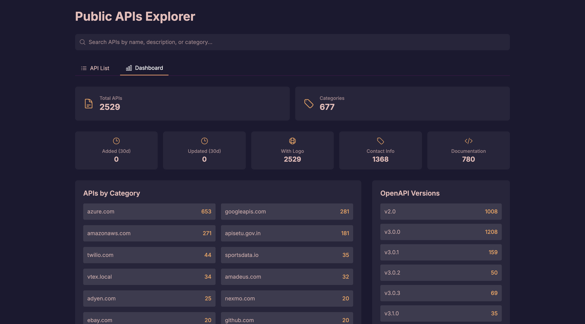

# Public APIs Explorer

A modern, responsive web application built with Next.js that allows users to explore and search through a collection of public APIs. The application provides an intuitive interface for discovering APIs, with detailed information about each API's features, authentication requirements, and more.

## Screenshots

### API List View


### Dashboard View


## Features

- 🔍 **Smart Search**: Search APIs by name, description, or category
- 🏷️ **Category Filtering**: Filter APIs by their categories with an easy-to-use dropdown
- 📊 **Dashboard View**: Visual representation of API statistics including:
  - Total number of APIs
  - Category distribution
  - Authentication types
  - CORS support
  - HTTPS usage
- 📱 **Responsive Design**: Fully responsive layout that works on desktop and mobile devices
- 🌓 **Dark Mode Support**: Built-in dark mode for better viewing experience
- 📄 **Pagination**: Efficient pagination system for handling large datasets
- 🔗 **API Details**: Detailed view for each API with comprehensive information

## Tech Stack

- **Framework**: Next.js 15 (App Router)
- **Styling**: Tailwind CSS
- **UI Components**: Radix UI
- **Icons**: Heroicons
- **Data Source**: Markdown file parsing

## Getting Started

### Prerequisites

- Node.js 18.x or later
- npm or yarn

### Installation

1. Clone the repository:
```bash
git clone <repository-url>
cd public-apis-explorer
```

2. Install dependencies:
```bash
npm install
# or
yarn install
```

3. Run the development server:
```bash
npm run dev
# or
yarn dev
```

4. Open [http://localhost:3000](http://localhost:3000) in your browser.

## Project Structure

```
public-apis-explorer/
├── src/
│   ├── app/                 # Next.js app router pages
│   │   ├── page.tsx        # Home page
│   │   ├── layout.tsx      # Root layout
│   │   ├── api/
│   │   │   └── [name]/     # API details page
│   │   └── dashboard/      # Dashboard page
│   ├── components/         # React components
│   │   ├── APIDetails.tsx  # API details component
│   │   ├── APIList.tsx     # API list component
│   │   ├── Dashboard.tsx   # Dashboard component
│   │   ├── SearchBar.tsx   # Search component
│   │   ├── TabsContainer.tsx # Navigation tabs
│   │   └── CategoryFilter.tsx # Category filter
│   ├── types/             # TypeScript type definitions
│   │   └── api.ts         # API interface definitions
│   └── utils/             # Utility functions
│       └── parseAPIs.ts   # Markdown parsing utility
├── public/                # Static assets
├── test.md               # APIs data source
├── tailwind.config.js    # Tailwind CSS configuration
├── next.config.js        # Next.js configuration
├── tsconfig.json         # TypeScript configuration
├── package.json          # Project dependencies and scripts
└── jest.config.js        # Jest test configuration

```

### Key Files and Directories

#### Configuration Files
- `next.config.js`: Next.js configuration including build settings and environment variables
- `tailwind.config.js`: Tailwind CSS theme customization and plugin configuration
- `tsconfig.json`: TypeScript compiler options and path aliases
- `package.json`: Project metadata, dependencies, and npm scripts

#### Source Code
- `src/app/`: Next.js 15 app router pages and layouts
- `src/components/`: Reusable React components
- `src/types/`: TypeScript interfaces and type definitions
- `src/utils/`: Helper functions and utilities

#### Data
- `test.md`: Main data source containing all API information in markdown format

#### Testing
- `jest.config.js`: Jest configuration for testing
- `src/__tests__/`: Test files organized by component and utility

## Key Components

- `TabsContainer`: Main navigation component with API List and Dashboard views
- `APIList`: Displays paginated list of APIs with search and filtering
- `Dashboard`: Shows statistical information about the APIs
- `APIDetails`: Detailed view of individual API information
- `SearchBar`: Global search functionality
- `CategoryFilter`: Category-based filtering component

## Testing

The project uses Jest and React Testing Library for testing. The test suite includes unit tests and integration tests for components and utilities.

### Test Structure

```
src/
├── __tests__/
│   ├── components/
│   │   ├── APIDetails.test.tsx
│   │   ├── APIList.test.tsx
│   │   ├── CategoryFilter.test.tsx
│   │   ├── Dashboard.test.tsx
│   │   └── TabsContainer.test.tsx
│   └── utils/
│       └── parseAPIs.test.ts
```

### Running Tests

```bash
# Run all tests
npm test

# Run tests in watch mode
npm run test:watch

# Generate coverage report
npm run test:coverage
```

### Coverage Requirements

The project maintains high test coverage requirements:
- Statements: 80%
- Branches: 80%
- Functions: 80%
- Lines: 80%

Current coverage meets or exceeds these thresholds for all components and utilities.

### Test Configuration

- **Jest**: Configured for Next.js with TypeScript support
- **React Testing Library**: Used for component testing
- **Mocks**:
  - `next/navigation`: Router and navigation functions
  - `next/link`: Link component
  - Child components in integration tests

### Writing Tests

Each test file follows these conventions:
1. Mock setup at the top
2. Test data/fixtures
3. Describe block with related test cases
4. Clear test descriptions
5. Proper cleanup in beforeEach when needed

Example:
```typescript
import { render, screen, fireEvent } from '@testing-library/react'

describe('ComponentName', () => {
  beforeEach(() => {
    jest.clearAllMocks()
  })

  it('should render correctly', () => {
    render(<Component />)
    expect(screen.getByText('Expected Text')).toBeInTheDocument()
  })
})
```

